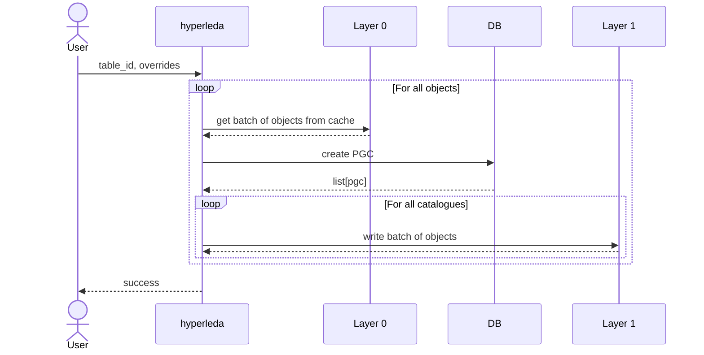

```mermaid
sequenceDiagram
    actor User
    User->>hyperleda: table_id, overrides
    
    loop For all objects
        hyperleda->>Layer 0: get batch of objects from cache
        Layer 0-->>hyperleda: 

        hyperleda->>DB: create PGC
        DB-->>hyperleda: list[pgc]

        loop For all catalogues
            hyperleda->>Layer 1: write batch of objects 
            Layer 1-->>hyperleda: 
        end
    end

    hyperleda-->>User: success
```